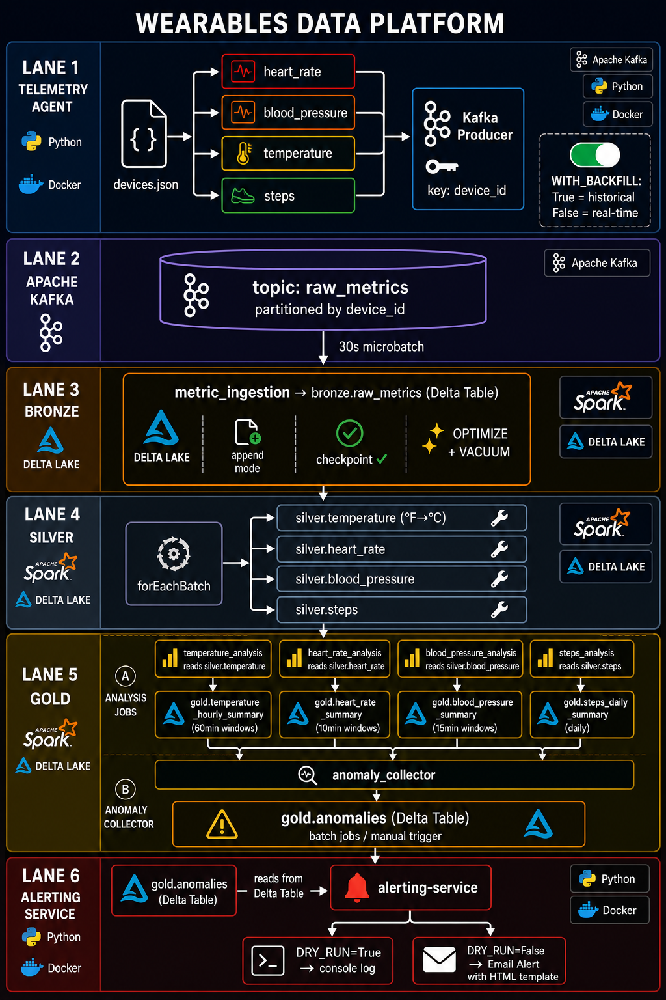
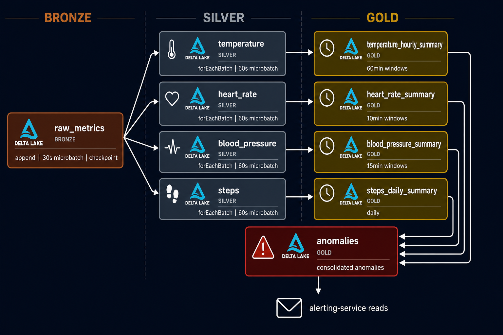
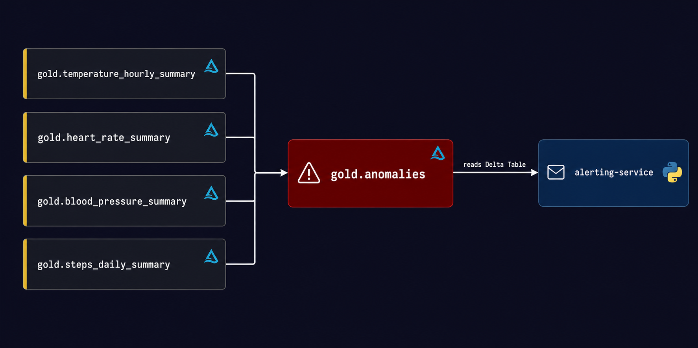
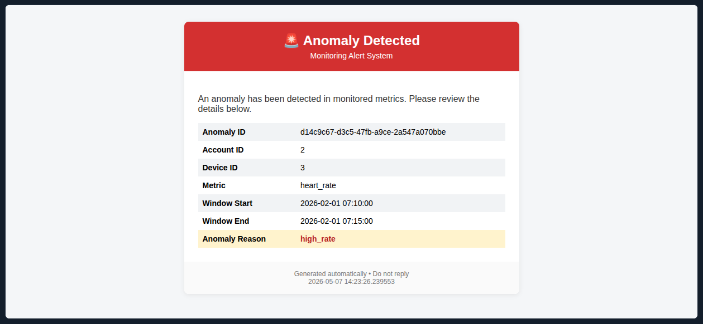
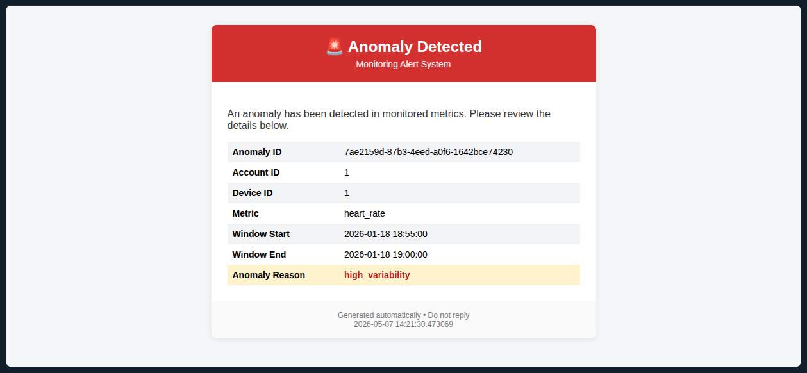

# Wearables Data Platform (iot-streaming-anomaly-detection)

> Projekt zaliczeniowy - Studia Podyplomowe WSB, Big Data & Inżynieria Danych  
> End-to-end platforma danych do przetwarzania strumieniowych danych sensorycznych z urządzeń wearable - od symulacji
> IoT eventów, przez architekturę Lakehouse Bronze/Silver/Gold, po anomaly detection i alerting.


---

## Spis treści

1. [Cel projektu](#1-cel-projektu)
2. [Architektura rozwiązania](#2-architektura-rozwiązania)
3. [Stack technologiczny](#3-stack-technologiczny)
4. [Moduły systemu](#4-moduły-systemu)
5. [Pipeline danych](#5-pipeline-danych)
6. [Struktura repozytorium](#6-struktura-repozytorium)
7. [Instrukcja uruchomienia](#7-Instrukcja-uruchomienia-na-lokalnym-srodowisku)

---

## 1. Cel projektu

### Problem biznesowy

Urządzenia wearable (smartwatche, opaski fitness, czujniki medyczne) generują ciągły strumień danych sensorycznych -
tętno, ciśnienie krwi, temperaturę ciała, aktywność fizyczną. Surowe dane z tych urządzeń są bezużyteczne bez
odpowiedniej infrastruktury umożliwiającej ich zbieranie, przetwarzanie, analizę i natychmiastowe reagowanie na
zdarzenia krytyczne.

Projekt adresuje następujące potrzeby:

- **Przetwarzanie w czasie rzeczywistym** - ciągłe zbieranie danych z wielu urządzeń jednocześnie
- **Ujednolicone składowanie** - jeden magazyn danych dla wszystkich typów metryk
- **Wykrywanie anomalii** - automatyczna identyfikacja nieprawidłowych wartości zdrowotnych
- **Alerting** - natychmiastowe powiadamianie o wykrytych anomaliach
- **Historyczna analityka** - możliwość przetwarzania dużych wolumenów danych historycznych

### Dlaczego Lakehouse?

Architektura Lakehouse łączy zalety Data Lake (skalowalność, niski koszt składowania surowych danych) z właściwościami
Data Warehouse (ACID transactions, schema enforcement, wydajne zapytania).

| Wymaganie                        | Data Lake | Data Warehouse | **Lakehouse** |
|----------------------------------|-----------|----------------|---------------|
| Niski koszt składowania raw data | ✅         | ❌              | ✅             |
| ACID transactions                | ❌         | ✅              | ✅             |
| Streaming ingestion              | ✅         | ❌              | ✅             |
| SQL analytics                    | ❌         | ✅              | ✅             |
| Schema evolution                 | ❌         | ❌              | ✅             |
| Time travel                      | ❌         | ❌              | ✅             |

---

## 2. Architektura rozwiązania

<p align="center">

</p>

### Opis komponentów

| Komponent                        | Technologia                | Rola                                                           |
|----------------------------------|----------------------------|----------------------------------------------------------------|
| **telemetry-agent**              | Python, kafka-producer     | Symulacja IoT eventów i publish do Kafki                       |
| **kafka-broker**                 | Apache Kafka 4.0.2         | Message broker, partycjonowanie po `device_id`                 |
| **`bronze`metric-ingestion-job** | Spark Structured Streaming | Bronze ingestion z Kafki do Delta Table                        |
| **`bronze`optimize-job**         | Delta Table                | Kompakcja małych plików Parquet w `bronze` (OPTIMIZE + VACUUM) |
| **`silver`metrics-cleanup-job**  | Spark `forEachBatch`       | Dystrybucja eventów z Bronze do Silver                         |
| **`gold`aggregation jobs**       | Spark batch jobs           | Agregacje okienkowe + anomaly detection                        |
| **`gold`anomaly-collector-job**  | Spark batch job            | Konsolidacja anomalii do `gold.anomalies`                      |
| **alerting-service**             | Python, Delta table        | Odczyt anomalii i wysyłka alertów e-mail                       |

## 3. Architektura Lakehouse

### Warstwy medalionowe

| Warstwa    | Cel                                    | Typ danych                               | Technologie                            |
|------------|----------------------------------------|------------------------------------------|----------------------------------------|
| **Bronze** | Raw ingestion bez transformacji        | Surowy binary payload z Kafki + metadata | Spark Structured Streaming, Delta Lake |
| **Silver** | Czyszczenie, walidacja, normalizacja   | Structured JSON per typ metryki          | Spark Structured Streaming, Delta Lake |
| **Gold**   | Agregacje biznesowe, anomaly detection | Agregaty okienkowe + tabela anomalii     | Spark batch, Delta Lake                |

<p align="center">

</p>

### Bronze - warstwa surowych danych

Warstwa Bronze implementuje wzorzec **multiplex ingestion** - wszystkie typy metryk trafiają do jednej tabeli
`bronze.raw_metrics`. Podejście upraszcza architekturę ingestii i pozwala na centralne zarządzanie checkpointem.

- **Mode:** append (surowe dane nigdy nie są nadpisywane)
- **Microbatch:** co 30 sekund (`processingTime="30 seconds"`)
- **Checkpoint:** zapewnia odporność na awarie
- **Problem małych plików:** każdy microbatch tworzy nowe pliki Parquet → job `optimize` wykonuje `OPTIMIZE` (kompakcja)
  i `VACUUM` (usuwanie plików bez referencji)

### Silver - warstwa transformacji

Warstwa Silver realizuje wzorzec **fan-out** przy użyciu `forEachBatch` - pojedyncze odczytanie źródła i zapis do
czterech dedykowanych tabel z metrykami.


> **Dlaczego `forEachBatch` zamiast 4 osobnych zapytań?**  
> Czytanie tego samego źródła 4 razy równolegle generuje 4x większe obciążenie I/O. `forEachBatch` odczytuje dane raz i
> dystrybuuje do odpowiednich tabel - efektywniejsze i spójne w ramach jednego batcha.
>

| Tabela                  | Przykładowe transformacje           |
|-------------------------|-------------------------------------|
| `silver.temperature`    | Konwersja °F → °C                   |
| `silver.heart_rate`     | Dodanie nowych kolumn               |
| `silver.blood_pressure` | Rozdzielenie `systolic`/`diastolic` |
| `silver.steps`          | Konwersja typów str → int           |

### Gold - warstwa analityczna

Joby Gold są batchowe i obliczają agregaty okienkowe oraz wykrywają anomalie domenowe.

| Job                       | Źródło                  | Okno    | Przykład anomalii                              |
|---------------------------|-------------------------|---------|------------------------------------------------|
| `temperature_analysis`    | `silver.temperature`    | 60 min  | temp < 35°C lub > 39.5°C                       |
| `heart_rate_analysis`     | `silver.heart_rate`     | 10 min  | bpm < 40 (bradykardia) lub > 150 (tachykardia) |
| `blood_pressure_analysis` | `silver.blood_pressure` | 15 min  | systolic > 180 mmHg                            |
| `steps_analysis`          | `silver.steps`          | dzienny | zbyt mała aktywność przez cały < 5000          |

Tabela `gold.anomalies` agreguje wszystkie wykryte anomalie z wszystkich Gold summary tables:

<p align="center">
 
</p>

## 3. Stack technologiczny

| Obszar                | Technologia                       | Wersja | Zastosowanie                                          |
|-----------------------|-----------------------------------|--------|-------------------------------------------------------|
| **Message Broker**    | Apache Kafka                      | 4.x    | Transport IoT eventów, partycjonowanie po `device_id` |
| **Stream Processing** | Apache Spark Structured Streaming | 3.5+   | Ingestion, transformacje, agregacje okienkowe         |
| **Storage Format**    | Delta Lake                        | 3.x    | ACID transactions, time travel, schema enforcement    |
| **Data Generation**   | Python                            | 3.11+  | Symulacja IoT eventów, generatory metryk              |
| **Kafka Client**      | confluent-kafka                   | 2.x    | Producer API dla Pythona                              |
| **Alerting**          | Python + SMTP                     | 3.11+  | Wysyłka alertów e-mail z HTML template                |
| **Konteneryzacja**    | Docker + Docker Compose           | latest | Orkiestracja i izolacja usług                         |

---

## 4. Moduły systemu

### `telemetry-agent`

Aplikacja Pythonowa symulująca strumień danych sensorycznych z urządzeń wearable. W środowisku produkcyjnym rolę agenta
przejęłyby bezpośrednio sensory urządzeń - moduł pełni funkcję **wyłącznie symulacyjną**.

**Startup flow:**

1. Załadowanie konfiguracji ze zmiennych środowiskowych
2. Wczytanie listy urządzeń z `devices.json`
3. Inicjalizacja generatorów metryk per urządzenie
4. Emisja eventów na topic Kafka `raw_metrics` (klucz partycji: `device_id`)

**Konfiguracja:**

| Zmienna                  | Opis                                                          |
|--------------------------|---------------------------------------------------------------|
| `KAFKA_BOOTSTRAP_SERVER` | Adres brokera Kafka                                           |
| `KAFKA_TOPIC`            | Docelowy topic (domyślnie: `raw_metrics`)                     |
| `DEVICE_SOURCE`          | Ścieżka do pliku `devices.json`                               |
| `ECHO`                   | Logowanie eventów na stdout (`True`/`False`)                  |
| `LOG_LEVEL`              | Poziom logowania (`DEBUG` / `INFO` / `WARNING`)               |
| `WITH_BACKFILL`          | Tryb backfill - emisja zdarzeń historycznych od początku roku |

**Tryby działania:**

- `WITH_BACKFILL=True` - emituje zdarzenia historyczne od 1 stycznia bieżącego roku do chwili uruchomienia; służy do
  testowania anomaly detection na dużej próbce danych
- `WITH_BACKFILL=False` - real-time symulacja, eventy generowane w czasie rzeczywistym

**Przykładowy event:**

```json
{
  "event_id": "f47ac10b-58cc-4372-a567-0e02b2c3d479",
  "account_id": 1,
  "device_id": 3,
  "metric_type": "heart_rate",
  "event_ts": "2026-05-07T14:32:10Z",
  "value": 87,
  "unit": "bpm"
}
```

### `stream-processor`

Moduł Sparkowy realizujący architekturę medalionową Bronze/Silver/Gold na Apache Spark Structured Streaming i Delta
Lake. Każdy job jest osobnym procesem PySpark uruchamianym jako dedykowany kontener Docker,
co zapewnia izolację zasobów i niezależny cykl życia każdego etapu pipeline'u.

| Job                           | Warstwa | Tryb           | Kontener                           |
|-------------------------------|---------|----------------|------------------------------------|
| `bronze_ingestion`            | Bronze  | Streaming      | bronze-spark-metric-ingestion      |
| `optimize`                    | Bronze  | Batch (ad-hoc) | 	bronze-spark-optimize             |
| `metrics_cleanup`             | Silver  | Streaming      | 	silver-spark-metric-cleanup       |
| `gold_temperature_hourly`     | Gold    | Batch          | 	gold-spark-hourly-temperature     |
| `gold_steps_daily_summary`    | Gold    | Batch          | 	gold-spark-daily-steps-summary    |
| `gold_heart_rate_summary`     | Gold    | Batch          | 	gold-spark-heart-rate-summary     |
| `gold_blood_pressure_summary` | Gold    | Batch          | 	gold-spark-blood-pressure-summary |
| `gold_collecting_anomalies`   | Gold    | Batch          | 	gold-spark-collecting-anomalies   |

### `alerting-service`

Serwis odczytujący `gold.anomalies` i wysyłający alerty e-mail z HTML template. Kolumna `alert_sent: bool` w tabeli
`gold.anomalies` zapewnia deduplikację - każda anomalia jest alertowana raz.

**Przykładowy alert:**

<p align="center">

</p>

<p align="center">
 
</p>

---

## 5. Pipeline danych

### Źródła danych

| Źródło              | Format                | Częstotliwość            | Opis                               |
|---------------------|-----------------------|--------------------------|------------------------------------|
| `devices.json`      | JSON                  | Jednorazowo przy starcie | Definicje urządzeń wearable        |
| Kafka `raw_metrics` | Binary (JSON payload) | Ciągły strumień          | IoT eventy z metrykami zdrowotnymi |
| `gold.anomalies`    | Delta Table           | Odczyt na zadanie        | Wykryte anomalie dla alertingu     |

### Harmonogramy

| Job                 | Tryb      | Rekomendowana częstotliwość |
|---------------------|-----------|-----------------------------|
| `bronze_ingestion`  | Streaming | 30s microbatch              |
| `metrics_cleanup`   | Streaming | 60s microbatch              |
| `optimize`          | Batch     | Manual ad-hoc               |
| `gold_*_summary`    | Batch     | Wg harmonogramu             |
| `anomaly_collector` | Batch     | Po gold jobs                |
| `alerting-service`  | Batch     | Po anomaly_collector        |

### Transformacje i walidacje

**Bronze:**

- Dodanie metadata: `ingested_at`

**Silver:**

- Deserializacja binary payload → JSON
- Ekstrakcja zagnieżdżonych pól z kolumny `value`
- Dystrybucja metryk do odpowiednich Delta Tables
- Walidacja zakresów per metryka
- Normalizacja jednostek (np. °F → °C dla temperatury)

**Gold:**

- Agregacje okienkowe (`window`, `groupBy`, `agg`)
- Wykrywanie anomalii
- Klasyfikacja krytycznosci alertu: np. `CRITICAL` / `HIGH` / `LOW`

### Scenariusze alertów

| Scenariusz                 | Warunek                                                       | Krytycznosc |
|----------------------------|---------------------------------------------------------------|-------------|
| `temp` HIGH_FEVER          | `avg_temp >= 39.5°C` w oknie 60 min                           | HIGH        | 
| `temp` FEVER               | `avg_temp >= 38.0°C` w oknie 60 min                           | MEDIUM      | 
| `temp` HYPOTHERMIA         | `avg_temp < 35.0°C` w oknie 60 min                            | HIGH        | 
| `blood_pressure` CRISIS    | `max_systolic >= 180 \| max_diastolic >= 120 ` w oknie 15 min | HIGH        |     
| `blood_pressure` HT_STAGE2 | `avg_systolic >= 140 \| avg_diastolic >= 90 ` w oknie 15 min  | MEDIUM      | 
| `blood_pressure` HT_STAGE1 | `avg_systolic >= 130 \| avg_diastolic >= 80 ` w oknie 15 min  | MEDIUM      | 
| `blood_pressure` ELEVATED  | `avg_systolic >= 120 & avg_diastolic < 80 ` w oknie 15 min    | LOW         | 
| `heart_rate` CRITICAL      | `avg_bpm > 170` w oknie 10 min                                | HIGH        | 
| `heart_rate` HIGH          | `avg_bpm > 140` w oknie 10 min                                | MEDIUM      | 
| `heart_rate` ELEVATED      | `avg_bpm > 100` w oknie 10 min                                | LOW         | 
| `steps` LOW_ACTIVITY       | `total_steps < 5000` przez cały dzień                         | LOW         |
| `steps` UNREALISTIC_SPIKE  | `max_steps_per_event > 200`                                   | LOW         |

---

## 6. Struktura repozytorium

```
iot-streaming-anomaly-detection/
├── docker-compose.yml                               
├── docs                                   
├── README.md
└── services                                         # Moduly aplikacyjne
    ├── alerting-service                             # Odczyt anomalii z Delta Table i wysyłka alertów e-mail
    │ ├── app
    │ │ ├── domain                                   # Model anomalii    
    │ │ ├── infrastructure                           # Delta reader/writer, Spark session, e-mail notifier    
    │ │ ├── main.py
    │ │ ├── resources                                # Szablon HTML alertu e-mail
    │ │ └── services                                 # Alert dispatcher — orchestruje odczyt i wysyłkę
    │ ├── Dockerfile
    │ └── requirements.txt
    ├── stream-processor                             # Pipeline Spark: Bronze → Silver → Gold
    │ ├── app
    │ │ ├── domain                                   # Transformacje i logika biznesowa per warstwa i typ metryki
    │ │ ├── infrastructure                           # Spark session, konfiguracja warstw, logging
    │ │ └── jobs                                     # Punkty wejścia jobów Spark (bronze, silver, gold, optimize)
    │ ├── Dockerfile
    │ └── requirements.txt
    └── telemetry-agent
        ├── app
        │ ├── domain                                # Generatory metryk per typ (heart_rate, temperature, ...)
        │ ├── infrastructure                        # Kafka producer, konfiguracja, logging
        │ ├── main.py
        │ ├── resources                             # devices.json - definicje urządzeń wearable
        │ └── services                              # Bootstrap, factory generatorów, tryby backfill/streaming
        ├── Dockerfile
        └── requirements.txt
```

---

## 7. Instrukcja uruchomienia na lokalnym srodowisku

### Konfiguracja

```bash
# 1. Sklonuj repozytorium
git clone https://github.com/JoannaKadlewicz/iot-streaming-anomaly-detection.git
cd iot-streaming-anomaly-detection

# 2. Skopiuj i uzupełnij konfigurację dla kazdego z serwisow
cp .env.example .env
```

Ustaw wymaganie zmienne srodowiskowe `.env`. Przykladowe ustawienia dla lokalnego developmentu:

```env
# Kafka
KAFKA_BOOTSTRAP_SERVER=kafka:9092
KAFKA_TOPIC=raw_metrics

# Spark
APP_NAME=iot-streaming-anomaly-detection
MASTER_URL=local[*]
BASE_PATH=/tmp/iot-streaming
DELTA_BASE_PATH=${BASE_PATH}/delta
CHECKPOINT_BASE_PATH=${BASE_PATH}/checkpoint

# Telemetry Agent
DEVICE_SOURCE=resources/samples/devices.json
ECHO=false
LOG_LEVEL=INFO
WITH_BACKFILL=false

# Alerting
DRY_RUN=true
SMTP_HOST=<your_host>
SMTP_PORT=587
SMTP_USER=<your_username>
SMTP_PASSWORD=<your_password>
SMTP_FROM=alerts@company.com
SMTP_TO=recipient@gmail.com
```

### Uruchomienie core pipeline'u

```bash
# Uruchom infrastrukturę + streaming pipeline
docker-compose up -d

### Backfill - ładowanie danych historycznych
```bash
# Ustaw WITH_BACKFILL=true w .env, następnie:
docker-compose up telemetry-agent
```

### Uruchomienie gold jobs (manualnie z profilem `manual`)

```bash
docker-compose --profile manual up -d gold-spark-hourly-temperature
docker-compose --profile manual up -d gold-spark-heart-rate-summary
docker-compose --profile manual up -d gold-spark-blood-pressure-summary
docker-compose --profile manual up -d gold-spark-daily-steps-summary
docker-compose --profile manual up -d gold-spark-collecting-anomalies
```

### Uruchomienie alerting service

```bash
# Dry run - alerty tylko na konsolę
docker-compose --profile manual up -d alerting-service

### Weryfikacja działania aplikacji

```bash
# Logi telemetry-agent
docker-compose logs -f telemetry-agent

# Logi Bronze ingestion
docker-compose logs -f bronze-spark-metric-ingestion

# Status wszystkich kontenerów
docker-compose ps

# Listowanie plikow wynikowych parquet i checkpointow
ls /tmp/delta/  
ls /tmp/checkpoints/

```

---

## Autor

**[Joanna Kadlewicz]**  
Studia Podyplomowe - WSB, Inżynieria Danych i Big Data  
Rok akademicki 2025/2026

---